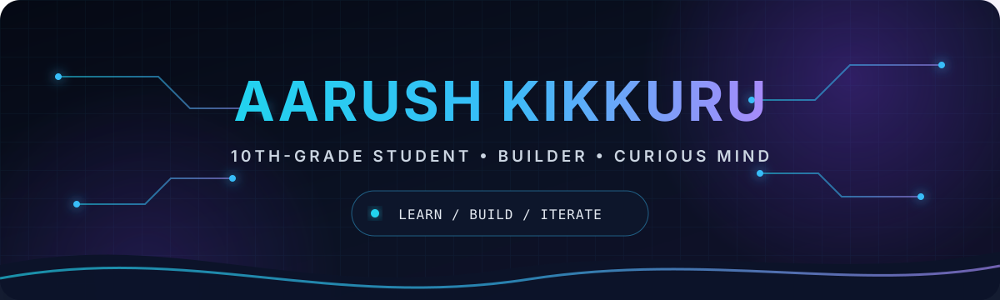

  

  
  

## About me

I’m Aarush, a 10th-grade student interested in the space where ideas become working software. I enjoy computer science, intelligent systems, and the logic behind the tools people use every day.

My approach is straightforward: understand the first principles, build a small version, test what breaks, and refine it. Right now, that means:

- 🔭 I build projects that force me to learn something new
- 🧠 I explore algorithms, artificial intelligence, and modern web development
- 🧪 I treat each project as an experiment: question, prototype, test, improve
- 📚 I value depth over buzzwords and progress over perfection

> The goal isn’t to know everything. It’s to become better at turning unknowns into experiments.

## My learning map

These are the questions guiding what I study and build:

| Area | Current focus |
| :-- | :-- |
| **Algorithms and logic** | How can I turn a difficult problem into clear, testable steps? |
| **Software engineering** | What makes code readable, reliable, and useful to someone else? |
| **Artificial intelligence** | How do data, models, and evaluation combine to produce intelligent behavior? |
| **Web systems** | How do interfaces, servers, and data work together as one product? |

## Tools I’m learning with

These technologies help me turn lessons and ideas into small projects:

  
  
  
  
  
  

## What you’ll find here

This profile will document my progress through:

- Small experiments that turn new concepts into working code
- School and personal projects with clear explanations
- Notes on what worked, what failed, and what I learned
- Increasingly ambitious builds as my skills grow

## GitHub snapshot

These cards update as I publish more work:

  
  

## Let’s connect

I’m always interested in thoughtful projects, new ideas, and opportunities to learn from people who love building things.

  
  

  Built with curiosity. Improved with every commit.

